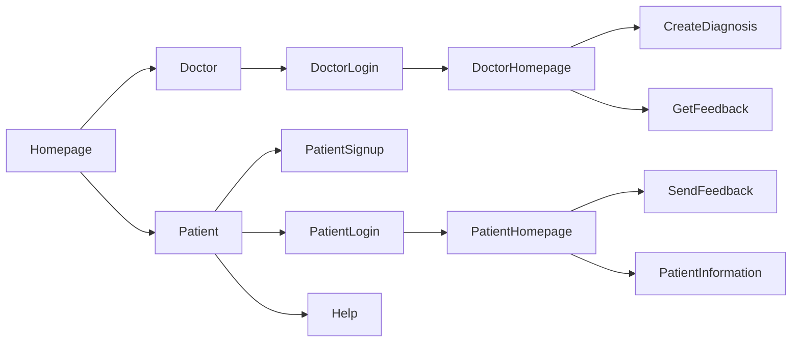

# Prototype for client

Client Workflow

# SW-distributed-system
Repository for the software project „Distributed System“

## Start of the system
- You need docker
- You need WSL (Windows Subsystem für Linux)

Then go into the directory of the whole project.
Command in cmd docker-compose up -d --build

The service starts with the address http://localhost:8080/
