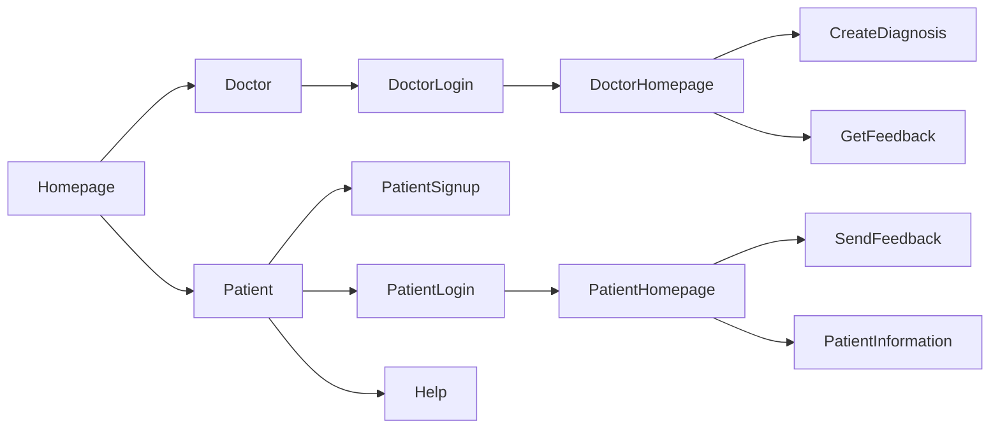

# Prototype for client

Client Workflow

```mermaid
graph LR;
    Homepage-->Doctor;
    Homepage-->Patient;
    Patient-->PatientSignup;
    Patient-->PatientLogin;
    Patient-->Help;
    PatientLogin-->PatientHomepage;
    PatientHomepage-->SendFeedback;
    PatientHomepage-->PatientInformation;
    Doctor-->DoctorLogin;
    DoctorLogin-->DoctorHomepage;
    DoctorHomepage-->CreateDiagnosis;
    DoctorHomepage-->GetFeedback;
```
